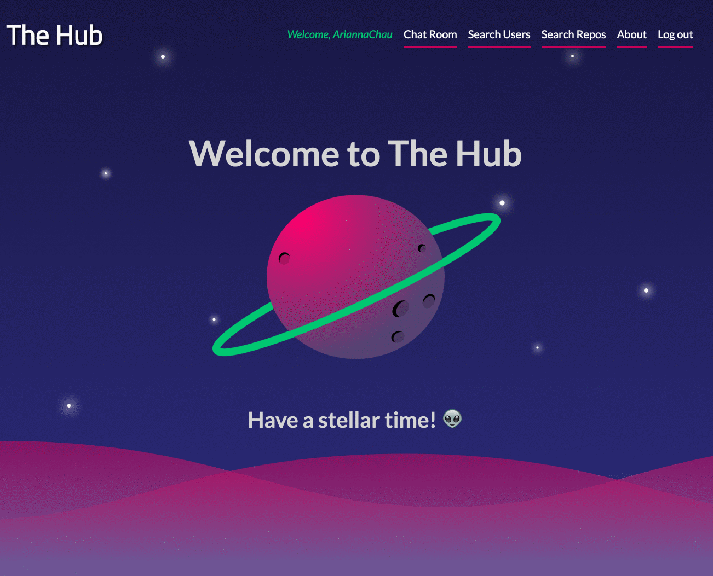
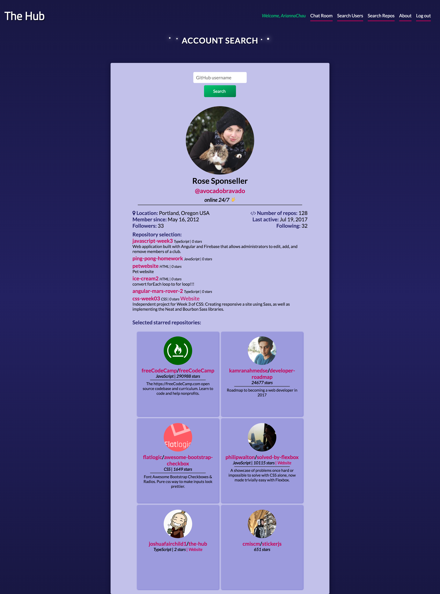
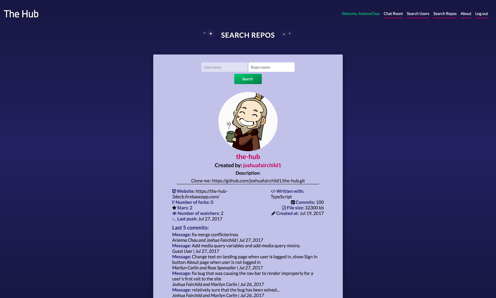
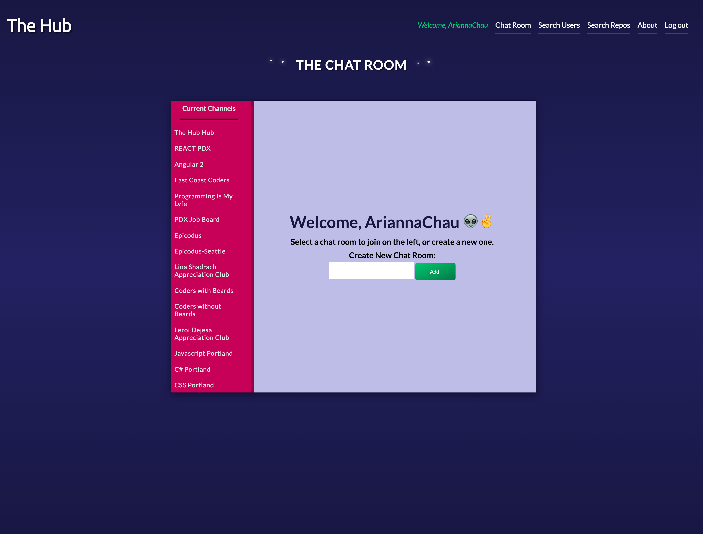
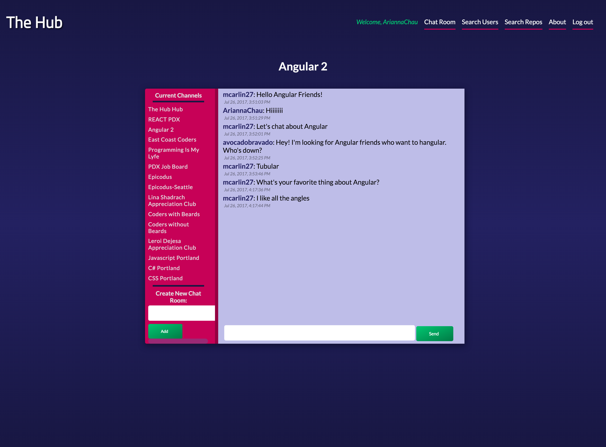

# The Hub
### Arianna Chau, Rose Sponseller, Marilyn Carlin and Joshua Fairchild, July 19th - 27th, 2017
[](https://github.com/joshuafairchild1/the-hub)

Description coming soon &#128175;

## Landing Page:


## About Page:


## Search User Page:


## Search Repositories Page:


## Chat Room Page:




## Planning

### 1. Configuration/dependencies
  The app will primarily use Angular 4, the AngularCLI, Firebase database, and Typescript. The app provides an improved Github user experience, including deeper search capabilities and user chatrooms.

  Stretch goals include:
    * Chrome Extension
    * 404 Page Design
    * Custom Sorting
    * Google Maps Integration
    * D3.js

### 2. User Stories
  * As a user, I'd like to be able to search for a github user via username.
  * As a user, I'd like to search for a certain repository.
  * As a user, I'd like the option to visit an "About" page that explains who worked on this app.
  * As a user, I'd like all data persisted in a database, so it's always there when I need it.
  * As a user, I would like to visit a chat page and chat with other Github users collectively.
  * As a user, I would like to create a new chatroom for others to join.


### 3. Integration
  * Root component/Index page
  * About page
  * Search for users page
  * Search by repositories
  * Chat room page

### 4. UX/UI
  * Sass
  * Adobe Illustrator

### 5. Polish
  * Refactor code
  * Delete unused code

## Prerequisites

You will need the following properly installed on your computer.

* [Git](https://git-scm.com/)
* [Node.js](https://nodejs.org/) (with NPM)
* [TypeScript](https://www.typescriptlang.org/)

## Installation

As of writing this README, these instructions work on MacOS.

* Clone this repository

  `$ git clone https://github.com/joshuafairchild1/the-hub`

* Run the following command from the root directory:

  `$ npm install`

This will download the project's dependencies

## Firebase Setup/Configuration

* Sign into the [firebase console](https://firebase.google.com/) and create a new project, then select "Add firebase to your web app". You will be presented with a modal window containing a few script tags, leave this information handy.

* In the directory `src/app` create a file called `api-key.ts` and add the following code:

  ```
  export const masterFirebaseConfig = {
    apiKey: "XXXX",
    authDomain: "XXXX",
    databaseURL: "XXXX",
    projectId: "XXXX",
    storageBucket: "XXXX",
    messagingSenderId: "XXXX"
  };

  ```
  * Note: for each property of the `masterFirebaseConfig` object, replace 'XXXX' with the information that firebase provided you in the previous step.


* Database content has been provided in a file called `db-content.json`, this can be uploaded to firebase directly.

  * Go to your database in the firebase console and click the button that looks like three dots.

  * Select 'Import JSON', browse, then navigate to the project folder and open the `db-content.json` file. Select 'Import' and your database should be complete!


## Running / Development

Now that everything you need should be installed and setup, you can start the server.

* Run `$ ng serve`
* Visit your app at http://localhost:4200.

## Built With

* Angular 4
* Angular CLI v1.0.0
* [GitHub's](https://developer.github.com/v3/) User, Repository and Search APIs
* CSS/SCSS
* TypeScript
* JavaScript
* Firebase using the [AngularFire2](https://github.com/angular/angularfire2) library

## Authors

Arianna Chau, Rose Sponseller, Marilyn Carlin and Joshua Fairchild

## License

MIT License

Copyright (c) Arianna Chau, Rose Sponseller, Marilyn Carlin and Joshua Fairchild, 2017

Permission is hereby granted, free of charge, to any person obtaining a copy
of this software and associated documentation files (the "Software"), to deal
in the Software without restriction, including without limitation the rights
to use, copy, modify, merge, publish, distribute, sublicense, and/or sell
copies of the Software, and to permit persons to whom the Software is furnished to do so, subject to the following conditions:

The above copyright notice and this permission notice shall be included in all
copies or substantial portions of the Software.
